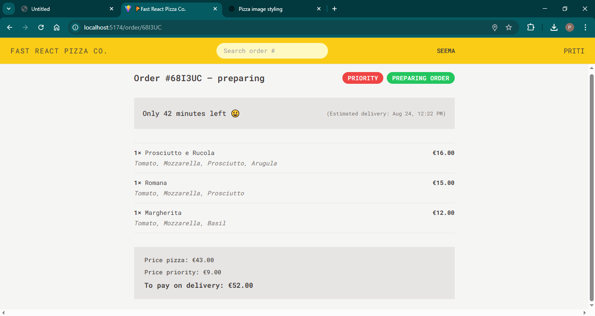

<<<<<<< HEAD
# React + Vite

This template provides a minimal setup to get React working in Vite with HMR and some ESLint rules.

Currently, two official plugins are available:

- [@vitejs/plugin-react](https://github.com/vitejs/vite-plugin-react/blob/main/packages/plugin-react/README.md) uses [Babel](https://babeljs.io/) for Fast Refresh
- [@vitejs/plugin-react-swc](https://github.com/vitejs/vite-plugin-react-swc) uses [SWC](https://swc.rs/) for Fast Refresh
=======
# Fast-React-Pizza-Co-
Fast React Pizza Co 
>>>>>>> 0bca0411d69a08c4beb9649ff34c7bdf2a6a1987


# 🍕 Fast React Pizza Co

A modern pizza ordering web application built with **React, Vite, Redux, and Tailwind CSS**.  
This project is part of my React learning journey, where I practiced routing, state management, forms, and API handling.

---

## 🚀 Features
- 🛒 Add pizzas to cart  
- ➕ Increase / decrease quantity  
- 💳 Place orders with form  
- ⏳ Track order status  
- 🎨 Responsive design with TailwindCSS  

---

## 🖼️ Screenshots

### Home Page


### Menu Page


### Cart Page


### order page 


---

## 🛠️ Tech Stack
- **React (Vite)** – for fast development  
- **React Router v6** – for routing  
- **Redux Toolkit** – for state management  
- **Tailwind CSS** – for styling  

---

## ⚡ How to Run Locally
```bash
# clone the repo
git clone https://github.com/Priti13032001/Fast-React-Pizza-Co-.git

# go to project folder
cd Fast-React-Pizza-Co-

# install dependencies
npm install

# start development server
npm run dev
